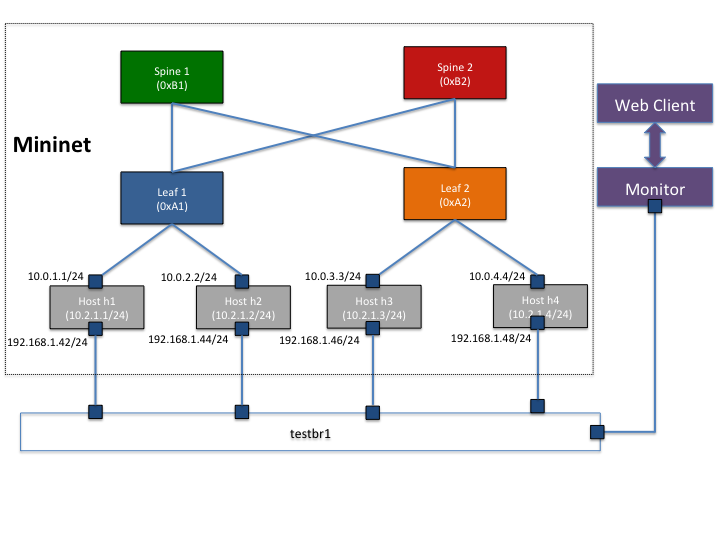
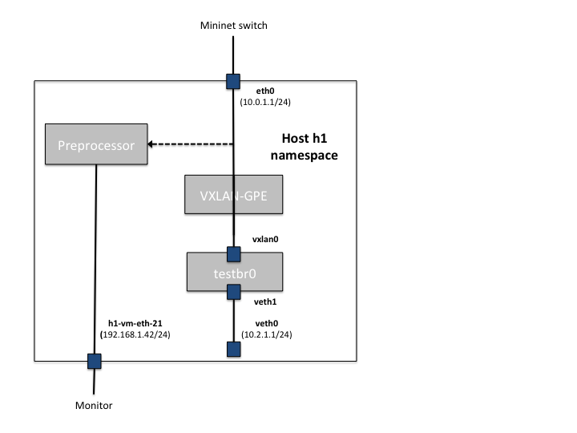

Overview
========

This is a reference app meant to be a proof-of-concept implementation of In-band Network Telemetry (INT) [For a complete description of the INT spec, refer to [[TODO]]]. The preprocessor, monitor and UI components (described below) have been provided merely to showcase a simple use case of the huge amount of network-monitoring information collected via INT. This app demonstrates the use of INT over VXLAN-GPE.

Setting up the environment
===========================

* Ensure that the following dependencies are met before running the INT reference app
  * Install linux kernel 3.19
    * On Ubuntu, the kernel can be upgraded to 3.19 by running the following command:
      * sudo apt-get install linux-generic-lts-vivid
  * Install other dependencies
    * sudo apt-get install python3
    * sudo apt-get install python3-pip
    * sudo pip3 install websockets
    * sudo pip3 install scapy-python3
    
* Build a docker image for the switch
  * cd p4factory/targets/switch
  * make docker-image

* Build and install the VXLAN-GPE driver provided in the repo
  * cd p4factory/apps/int/vxlan-gpe
  * make
  * sudo ./install_driver.sh
  * Ensure that the driver has been installed successfully using one of the following checks
    * lsmod | grep vxlan - this should list vxlan as one of the loaded modules
    * dmesg | grep 
      * If the driver was installed successfully, this should list the following message: "[VXLAN-GPE] Loading VXLAN-GPE driver"

Running the reference app
=========================

* Start mininet and run the reference topology
  * cd p4factory/mininet
  * sudo ./int_ref_topology.py

* Open the web client that visualizes the INT data collected from the mininet instance
  * Open p4factory/apps/int/monitor/client/index.html
  * NOTE: The web client has been tested only on Google Chrome. Hence, we recommend using Google Chrome to view the web client

Restarting the reference app
============================

* In order to restart the app
    * Close the web client
    * Stop the mininet script int_ref_topology.py
    * Run the following cleanup script
      * cd p4factory/mininet
      * sudo ./int_cleanup.sh
    * Now start the app once again as described in the previous section

Mininet topology used in the reference app
===========================================

We use mininet to set up a test network for the app. The network is composed of 4 hosts, 2 ToR switches and 2 spine switches. The switches are connected in a leaf-spine architecture. The following diagram illustrates the topology in greater detail.

Each mininet host has 3 major interfaces:

1. eth0 : Connected to one of the ToR switches
2. veth0 : A VTEP that connects to the VXLAN on the 10.2.1.0/24 subnet.
3. hn-vm-ethn: Connects to the monitor process, which runs on the underlying machine. The monitor process aggregates INT data from each of the mininet hosts, aggregates the data and sends the results to a web-client, which then visualizes it.

Routing configuration of the switches
-------------------------------------

* The switches run eBGP to exchange routing information.
* Each leaf switch has its own unique AS number, and the spine switches share one common AS number.

Background traffic
------------------

The mininet script automatically invokes full-mesh ping sessions among all the four end hosts.

End-host networking stack
==========================

As described in the previous section, each mininet host has a VTEP. The VXLAN-GPE driver enables INT on all IP unicast packets sent from a host through its VTEP. Within the INT metadata header, the instruction mask bits for switchID, hop latency and queue occupancy are set. Hence, each switch along the path of the packet would append these 3 bits of information to the packet. 

Each host runs an instance of a preprocessor process, which captures all the VXLAN-GPE packets that arrive at the host. The preprocessor strips out the INT headers and metadata values and sends them to the monitor process.

Web client UI
=============

The web client connects to the monitor process via a websocket, which is a protocol that provides full-duplex communication channels over a single TCP connection. The monitor notifies the client when a (i) new flow is detected in the network or (ii) a path change is detected in an existing flow. Additionally, the monitor periodically (every 10ms) sends the max latency encountered by each switch within that interval, to the client.

The UI has the following components: 

1. Flow filter: A drop down box that lists all the flows seen in the network. Choose one of the options to view data corresponding to a particular flow
2. Network topology graph: Visualizes the topology of the mininet network. For a given flow, the topology graph highlights the flow's current path in blue. In case of a path change in the flow, the old path is highlighted in red.
3. Real-time hop latencies per switch: One timeseries graph is shown per switch. Each bar in the graph indicates the max hop latency observed at that switch in a particular 10ms window. These timeseries charts refresh every 1 sec.
4. Notifications window: Whenever a loop is detected in the path taken by a packet, a text notification is displayed here.

The switches are color-coded in the graphs. The legend explaining the switch-to-color mapping is provided below the network topology graph.

Test cases
==========

* The mininet script also launches "iperf" servers in the background. Hence, one can easily run "iperf" tests.
  * Open a terminal in the h1 name space: type "h1 xterm" at the mininet CLI
  * Start an iperf session from h1 to h3: type "iperf -c 10.2.1.3 -t 60" in the h1's terminal
  * Choose the new iperf connection via the flow filter on the UI
  * Confirm the physical path the connection is taking, as well as the individual hop latency values collected via each packet.

* Fail-over test
  * Run a long-running iperf connection between h1 and h3. Check which spine switch the connection passes through -- use the UI for this.
  * Open a terminal in the leaf1 name space: type "leaf1 xterm" at the mininet CLI
  * If the connection is going through spine1, shut down the port on leaf2 that is connected to spine1. You can do this by typing "ifconfig swp3 down" in the leaf1 xterm. If it is going through spine2, type "ifconfig swp4 down" instead.
  * Confirm the physical path for the ongoing connection changes after 3sec, which is the BGP hold-down timeout.

Known issues
============

* Performance problems
  * If you run the entire test setup in one machine with a limited # of CPU cores, and run several high-volume connections, then the system can get overloaded. In such a situation, the reported hop latency values can be very high because packet-handling threads in the P4 s/w switch (behavioral model) might not be scheduled timely.
  * Introducing more switches, increasing the bandwidth limit of the mininet links, introducing a larger number of active connections, etc. can increase the contention for CPU cycles, increasing performance issues. 

* iperf server process can hang under high workload
